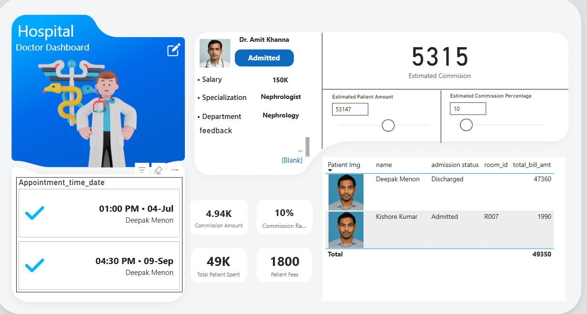
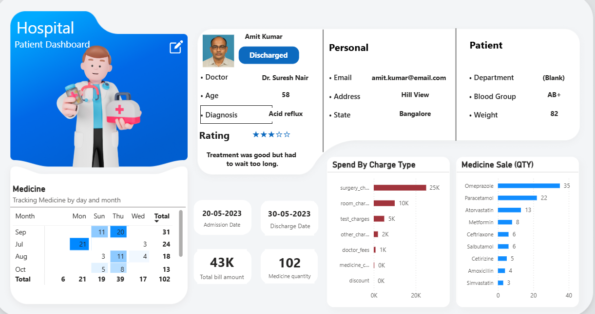

# Hospital Analytics Dashboard – Power BI

This repository contains an interactive Power BI dashboard designed to analyze key hospital operations across doctor performance, patient insights, billing, and medicine management.  
It includes two main dashboards:

- **Doctor Dashboard**
- **Patient Dashboard**

---

## 📊 Doctor Dashboard

### Key Features
- Doctor profile overview (specialization, department, salary, status)
- Appointment schedule with date and time
- Estimated commission calculator
- Patient admission summary
- Total patient billing linked to the selected doctor
- KPIs: Commission Amount, Commission Rate, Total Patient Spend, Patient Fees

### Preview

---

## 👨‍⚕️ Patient Dashboard

### Key Features
- Patient profile (age, diagnosis, doctor, contact details, blood group, address)
- Patient rating and feedback
- Admission and discharge dates
- Spend breakdown by charge type
- Medicine tracking by day and month
- Medicine sales quantity comparison
- KPIs: Total Bill Amount, Medicine Quantity

### Preview

---

## 🛠️ Tools & Technologies
- Power BI Desktop
- Power Query Editor
- DAX (Data Analysis Expressions)
- Custom visuals and KPI cards

---

## 📁 Dataset
The dashboards analyze various hospital-related datasets, including:

- Patient records  
- Doctor records  
- Billing and charge details  
- Appointment data  
- Medicine sales data  

---

## 🚀 Purpose
This project demonstrates:

- Practical healthcare analytics
- Professional Power BI dashboard design
- KPI-driven reporting
- Portfolio-ready BI development skills

---

## 📦 How to Use
1. Clone or download this repository  
2. Open the `.pbix` file in **Power BI Desktop**  
3. Load or reconnect your data source (if required)  
4. Refresh visuals and explore the dashboards  

---

## 💡 Future Improvements
- Drill-through pages
- Predictive analytics features
- Role-Level Security (RLS)
- Real-time Power BI Service integration

---
